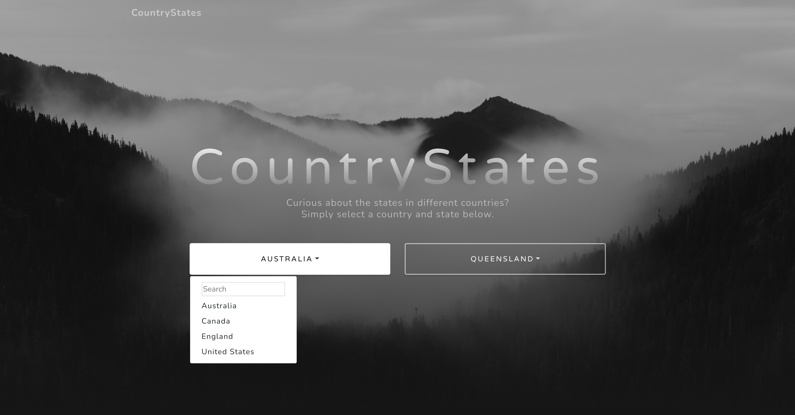

# CountryStates

Onboarding project for NextUp Solutions.

This demonstrates running asynchronous JS code to hit a web API. The API is on-demand, so load times may be significant if the page has not been used by anyone in a few hours/days.

This doesn't use modern web development practices such as Webpack and Babel - it was more of an introductory project. It also uses a free online theme (I did not design the theme's UI, but I did design the page layout).

### Screenshot

